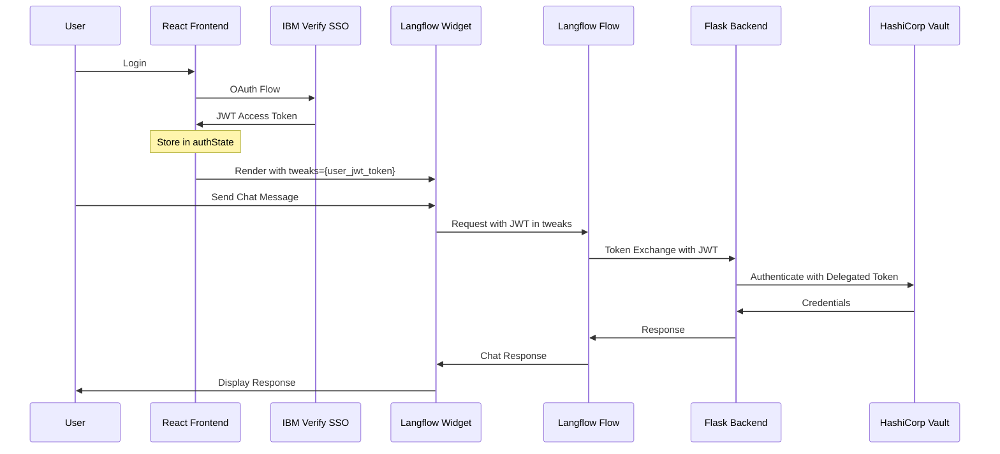

# Langflow Chat Widget Integration Plan

## Overview

This document outlines the integration of the Langflow embedded chat widget into the AskHR React TypeScript application with JWT token authentication via the `tweaks` prop.

## Current Application Stack

- **Framework**: React 18.2.0 with TypeScript
- **Build Tool**: Create React App (react-scripts)
- **UI Library**: IBM Carbon Design System
- **Authentication**: IBM Verify SSO with custom OAuth flow
- **Backend**: Flask API at `http://localhost:5001`
- **Langflow**: Running at `http://localhost:7860`

## Architecture Flow



## Implementation Components

### 1. ChatWidget Component

**Location**: `demo-app/frontend/src/components/ChatWidget.tsx`

**Purpose**: 
- Encapsulate the Langflow web component
- Handle TypeScript declarations
- Dynamically load the Langflow CDN script
- Pass user JWT token via tweaks prop

**Props Interface**:
```typescript
interface ChatWidgetProps {
  userToken: string;           // JWT from authState.accessToken
  flowId: string;              // Langflow flow ID
  hostUrl: string;             // Langflow backend URL
  apiKey: string;              // Langflow API key
  windowTitle?: string;        // Optional chat window title
  className?: string;          // Optional CSS class
}
```

**Key Features**:
- TypeScript declarations for `langflow-chat` web component
- `ChatScriptLoader` component for dynamic script loading
- Tweaks prop formatted as JSON string with user JWT token
- Error boundary handling
- Loading states

### 2. Integration in App.tsx

**Location**: `demo-app/frontend/src/App.tsx`

**Changes**:
- Import ChatWidget component
- Add chat section in authenticated area
- Pass `authState.accessToken` to ChatWidget
- Configure with environment variables

**Placement**: Below user info section, above "Next Steps"

**Example Integration**:
```typescript
{authState.isAuthenticated && authState.accessToken && (
  <div className="chat-section">
    <h3>💬 Ask the HR Assistant</h3>
    <ChatWidget 
      userToken={authState.accessToken}
      flowId={process.env.REACT_APP_LANGFLOW_FLOW_ID || '6158c23c-7d05-49db-ba6e-0b3304f7df2a'}
      hostUrl={process.env.REACT_APP_LANGFLOW_HOST_URL || 'http://localhost:7860'}
      apiKey={process.env.REACT_APP_LANGFLOW_API_KEY || ''}
      windowTitle="AskHR-Agent"
      className="chat-widget-container"
    />
  </div>
)}
```

### 3. Environment Variables

**Location**: `.env.template` and `.env`

**Required Variables**:
```bash
# Langflow Configuration
REACT_APP_LANGFLOW_API_KEY=your_langflow_api_key_here
REACT_APP_LANGFLOW_HOST_URL=http://localhost:7860
REACT_APP_LANGFLOW_FLOW_ID=6158c23c-7d05-49db-ba6e-0b3304f7df2a
```

**Note**: All React environment variables must be prefixed with `REACT_APP_`

### 4. Styling

**Location**: `demo-app/frontend/src/App.css`

**New Styles**:
- `.chat-section` - Container for chat widget
- `.chat-widget-container` - Widget wrapper
- Responsive design for mobile/desktop
- Integration with IBM Carbon Design System theme
- Loading and error states

### 5. Tweaks Parameter Configuration

**Purpose**: Pass runtime parameters to Langflow flow

**Format**:
```typescript
const tweaks = JSON.stringify({
  user_jwt_token: userToken  // JWT from SSO login
});
```

**Usage in Web Component**:
```html
<langflow-chat
  host_url="http://localhost:7860"
  flow_id="6158c23c-7d05-49db-ba6e-0b3304f7df2a"
  api_key="$LANGFLOW_API_KEY"
  window_title="AskHR-Agent"
  tweaks='{"user_jwt_token": "eyJhbGc..."}'
></langflow-chat>
```

**Flow Integration**:
- Langflow flow receives `user_jwt_token` from tweaks
- Token Exchange Tool uses it as subject token
- Performs delegation with actor token
- Returns delegated token with 'act' claim
- Used for Vault JWT authentication

## Security Considerations

### Token Handling

✅ **Current Approach**:
- JWT token stored in React state after SSO login
- Token passed directly to Langflow widget (client-side)
- Langflow flow receives token via tweaks parameter
- Token Exchange Tool performs server-side delegation
- No additional exposure beyond current architecture

⚠️ **Security Notes**:
- Token is visible in browser memory and DevTools (same as current state)
- Token has expiration managed by IBM Verify SSO
- Langflow should validate token server-side
- Consider implementing token refresh for long sessions
- Monitor token usage in Langflow logs

### Best Practices

1. **Token Validation**: Langflow flow should validate JWT signature and expiration
2. **Least Privilege**: Use delegated tokens with minimal required permissions
3. **Audit Logging**: Log all token exchanges and Vault access
4. **Error Handling**: Gracefully handle expired or invalid tokens
5. **Session Management**: Implement token refresh mechanism

## File Structure

```
demo-app/frontend/
├── src/
│   ├── components/
│   │   └── ChatWidget.tsx          # New: Chat widget component
│   ├── App.tsx                      # Modified: Add ChatWidget integration
│   ├── App.css                      # Modified: Add chat widget styles
│   ├── index.tsx                    # No changes
│   └── index.css                    # No changes
├── public/
│   └── index.html                   # No changes
├── package.json                     # No changes needed
├── .env.template                    # Modified: Add Langflow config
└── .env                             # Create: Add actual values
```

## Implementation Steps

### Step 1: Create ChatWidget Component
- [ ] Create `components` directory if not exists
- [ ] Create `ChatWidget.tsx` with TypeScript declarations
- [ ] Implement `ChatScriptLoader` for dynamic script loading
- [ ] Add props interface and component logic
- [ ] Handle tweaks prop with JWT token

### Step 2: Update Environment Configuration
- [ ] Add Langflow variables to `.env.template`
- [ ] Create `.env` file with actual values
- [ ] Document environment variables

### Step 3: Integrate into App.tsx
- [ ] Import ChatWidget component
- [ ] Add chat section in authenticated area
- [ ] Pass `authState.accessToken` to widget
- [ ] Configure with environment variables

### Step 4: Add Styling
- [ ] Add chat section styles to `App.css`
- [ ] Ensure responsive design
- [ ] Match IBM Carbon Design System theme
- [ ] Add loading and error states

### Step 5: Testing
- [ ] Test widget loads after authentication
- [ ] Verify JWT token is passed via tweaks
- [ ] Test chat functionality with Langflow
- [ ] Verify Token Exchange Tool receives JWT
- [ ] Test delegation and Vault authentication
- [ ] Test error handling for expired tokens

### Step 6: Documentation
- [ ] Update `demo-app/README.md` with chat widget info
- [ ] Document tweaks parameter usage
- [ ] Add troubleshooting section
- [ ] Include security best practices

## Testing Strategy

### Unit Tests
- ChatWidget component renders correctly
- Props are passed correctly to web component
- Script loads only once (no duplicates)
- Tweaks JSON is properly formatted

### Integration Tests
1. **Authentication Flow**
   - User logs in via IBM Verify SSO
   - JWT token stored in authState
   - ChatWidget receives token

2. **Chat Functionality**
   - User sends message to chat
   - Message triggers Langflow flow
   - Flow receives JWT via tweaks
   - Token Exchange Tool processes JWT

3. **Token Exchange**
   - Subject token (user JWT) validated
   - Actor token obtained via client credentials
   - Delegation performed (RFC 8693)
   - Delegated token contains 'act' claim

4. **Vault Authentication**
   - Delegated token used for Vault JWT auth
   - User identity and groups validated
   - Appropriate policy applied
   - Credentials retrieved based on permissions

### Error Scenarios
- Expired JWT token
- Invalid JWT token
- Langflow backend unavailable
- Token exchange failure
- Vault authentication failure
- Network errors

## Langflow Flow Configuration

### Required Flow Parameters

Your Langflow flow should accept the following parameter via tweaks:

```json
{
  "user_jwt_token": "string"
}
```

### Token Exchange Tool Configuration

The Token Exchange Tool in your flow should:
1. Accept `user_jwt_token` as input (from tweaks)
2. Use it as the subject token
3. Enable "Use Delegation (RFC 8693)"
4. Automatically obtain actor token via client credentials
5. Return delegated token with 'act' claim

### Example Flow Structure

```
User Input → Token Exchange Tool → Vault Credentials Tool → Database Tool → Response
              ↑
              user_jwt_token (from tweaks)
```

## Troubleshooting

### Widget Not Loading
- Check browser console for script loading errors
- Verify Langflow CDN URL is accessible
- Ensure script loads only once

### Token Not Passed
- Verify `authState.accessToken` is not null
- Check tweaks prop formatting (must be valid JSON string)
- Inspect network requests in DevTools

### Chat Not Working
- Verify Langflow backend is running at `http://localhost:7860`
- Check flow_id matches your deployed flow
- Verify API key is correct
- Check Langflow logs for errors

### Token Exchange Fails
- Verify JWT token is valid and not expired
- Check Token Exchange Tool configuration
- Verify IBM Verify three-client setup
- Check backend logs for token exchange errors

### Vault Authentication Fails
- Verify Vault JWT auth method is configured
- Check JWT role and policy bindings
- Verify token contains required claims
- Check Vault audit logs

## References

### Documentation
- [Langflow Embedded Chat Documentation](https://docs.langflow.org/integrations-embedded-chat)
- [IBM Verify Three-Client Setup](../docs/IBM_VERIFY_THREE_CLIENT_SETUP.md)
- [Token Exchange RFC 8693](https://datatracker.ietf.org/doc/html/rfc8693)
- [Vault JWT Auth Method](https://developer.hashicorp.com/vault/docs/auth/jwt)

### Related Files
- [`demo-app/frontend/src/App.tsx`](frontend/src/App.tsx) - Main application component
- [`demo-app/backend/app.py`](backend/app.py) - Flask backend with token exchange
- [`demo-app/tools/token_exchange_tool.py`](tools/token_exchange_tool.py) - Token exchange implementation
- [`security/token_exchange.py`](../security/token_exchange.py) - Token exchange logic

## Success Criteria

✅ **Implementation Complete When**:
1. ChatWidget component created and functional
2. JWT token successfully passed via tweaks
3. Chat messages trigger Langflow flow
4. Token Exchange Tool receives and processes JWT
5. Delegation works with user context
6. Vault authentication succeeds with delegated token
7. User-specific data retrieved based on permissions
8. Error handling works for all scenarios
9. UI is responsive and matches design system
10. Documentation is complete and accurate

## Next Steps

After implementation:
1. Test with different user roles (HR Admin, HR Basic)
2. Monitor token exchange performance
3. Implement token refresh mechanism
4. Add analytics for chat usage
5. Consider adding chat history persistence
6. Implement rate limiting for chat requests
7. Add user feedback mechanism

---

**Document Version**: 1.0  
**Last Updated**: 2026-02-26  
**Author**: Bob (Plan Mode)  
**Status**: Ready for Implementation